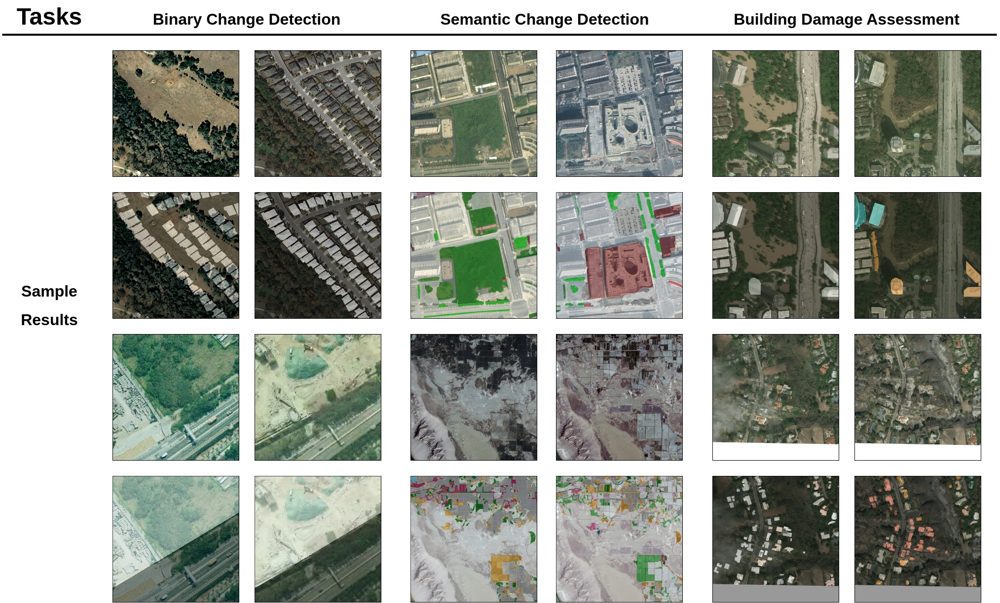

<div align="center">
  
</div>

## 1. Overview of UFCD
UFCD is a Pytorch-based toolbox for three different change detection tasks, including binary change detection (BCD), semantic change detection (SCD), and building damage assessment (BDA).
<div align="center">
  
</div>


## 2. Usage

✈️ `Step 1`

To get started, clone this repository:
```bash
git clone https://github.com/guanyuezhen/UFCD.git
```

Next, create the [conda](https://docs.conda.io/projects/conda/en/stable/) environment named `ufcd` by executing the following command:
```bash
conda create -n ufcd python=3.8
```
Install necessary packages:
```bash
pip install -r requirements.txt
```

✈️ `Step 2`

Prepare the change detection datasets following [./data/README.md](./data/README.md).

✈️ `Step 3`

Train/Test:
```shell
sh ./scripts/train.sh  
sh ./scripts/test.sh   
 ```
## 3. Currently Supported Models and Datasets

Supported change detection models:

|Model|Task|Paper|Link|
|:----|:----|:----|:----|
|A2NetBCD|BCD|Lightweight Remote Sensing Change Detection With Progressive Feature Aggregation and Supervised Attention|[link](https://ieeexplore.ieee.org/abstract/document/10034814/)|
|AR-CDNetBCD|BCD|Towards Accurate and Reliable Change Detection of Remote Sensing Images via Knowledge Review and Online Uncertainty Estimation|[link](https://arxiv.org/abs/2305.19513)|
|TFI-GR|BCD|Remote Sensing Change Detection via Temporal Feature Interaction and Guided Refinement|[link](https://ieeexplore.ieee.org/abstract/document/9863802)|
|A2Net|SCD|Lightweight Remote Sensing Change Detection With Progressive Feature Aggregation and Supervised Attention|[link](https://ieeexplore.ieee.org/abstract/document/10034814/)|
|SCanNet/TED|SCD|Joint Spatio-Temporal Modeling for the Semantic Change Detection in Remote Sensing Images|[link](https://arxiv.org/abs/2212.05245)|
|BiSRNet/SSCDL|SCD|Bi-Temporal Semantic Reasoning for the Semantic Change Detection in HR Remote Sensing Images|[link](https://ieeexplore.ieee.org/document/9721305)|
|ChangeOS|BDA|Building Damage Assessment for Rapid Disaster Response with a Deep Object-based Semantic Change Detection Framework: From Natural Disasters to Man-made Disasters|[link](https://www.sciencedirect.com/science/article/pii/S0034425721003564)|
|ChangeOS-GRM|BDA|-|-|
|AR-CDNet|BCD|Towards Accurate and Reliable Change Detection of Remote Sensing Images via Knowledge Review and Online Uncertainty Estimation|[link](https://arxiv.org/abs/2305.19513)|


Supported binary change detection datasets:

|Model|Task|Link|
|:----|:----|:----|
|LEVIR/LEVIR+|BCD|[link](https://justchenhao.github.io/LEVIR/)|
|SYSU|BCD|[link](https://github.com/liumency/SYSU-CD)|
|S2Looking|BCD|[link](https://github.com/S2Looking/Dataset)|
|SECOND|SCD|[link](https://ieeexplore.ieee.org/abstract/document/9555824)|
|Landsat-SCD|SCD|[link](https://figshare.com/articles/figure/Landsat-SCD_dataset_zip/19946135/1)|
|xView2|BDA|[link](https://xview2.org/)|


## 4. Acknowledgment
This repository is built with the help of the projects:

[BIT_CD](https://github.com/justchenhao/BIT_CD)

[PytorchDeepLearing](https://github.com/junqiangchen/PytorchDeepLearing)

[SCanNet](https://github.com/ggsDing/SCanNet)

[Simple-Remote-Sensing-Change-Detection-Framework](https://github.com/walking-shadow/Simple-Remote-Sensing-Change-Detection-Framework)


## 5. Ending
If you feel our work is useful, please remember to Star and consider citing our work. Thanks!~😘.
```bibtex
@article{Li_2023_A2Net,
        author={Li, Zhenglai and Tang, Chang and Liu, Xinwang and Zhang, Wei and Dou, Jie and Wang, Lizhe and Zomaya, Albert Y.},
        journal={IEEE Transactions on Geoscience and Remote Sensing}, 
        title={Lightweight Remote Sensing Change Detection With Progressive Feature Aggregation and Supervised Attention}, 
        year={2023},
        volume={61},
        number={},
        pages={1-12},
        doi={10.1109/TGRS.2023.3241436}
}
@article{li2022cd,
        author={Li, Zhenglai and Tang, Chang and Wang, Lizhe and Zomaya, Albert Y.},
        journal={IEEE Transactions on Geoscience and Remote Sensing}, 
        title={Remote Sensing Change Detection via Temporal Feature Interaction and Guided Refinement}, 
        year={2022},
        volume={60},
        number={},
        pages={1-11},
        doi={10.1109/TGRS.2022.3199502}
}
```
